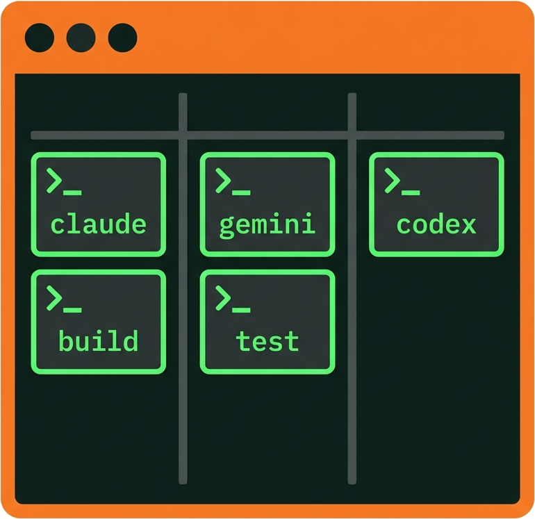
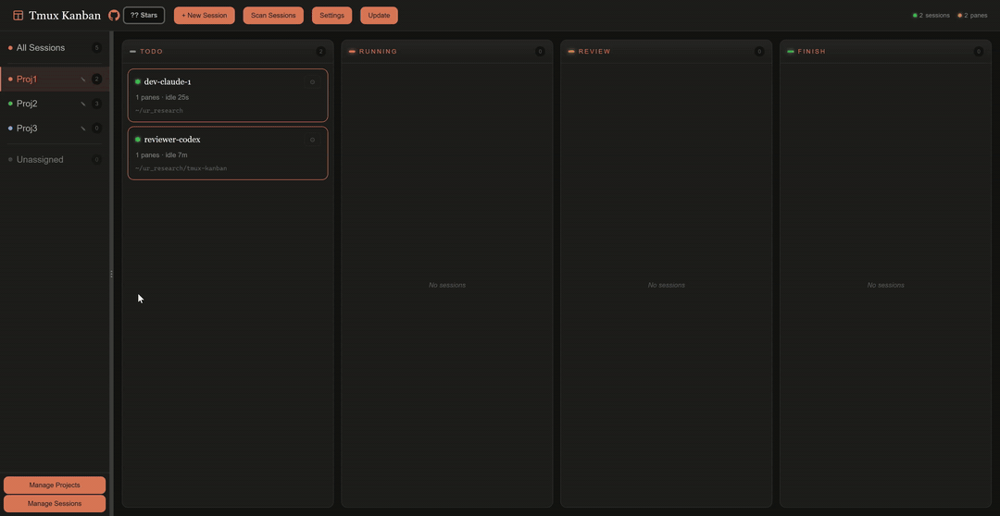

<div align="center">

[English](README.md) | **中文**



# tmux-kanban

**一个面向 AI 时代的 tmux 看板工具。**

通过拖拽式的 Web 面板管理你的终端会话 —— AI Agent、开发服务器、构建脚本，什么都行 —— 后端接的是原生 tmux 终端。

[](https://python.org)
[](LICENSE)
[](https://github.com/tmux/tmux)

[为什么选 tmux-kanban？](#-为什么选-tmux-kanban) &bull; [核心特性](#-核心特性) &bull; [快速开始](#-快速开始) &bull; [Roadmap](TODO.md)

<br>



</div>

---

> **⚠️ Beta 版本。** 这是一个 vibe-coding 的产物。虽然经过两周的自测没有问题，但仍可能存在 bug —— 如果你遇到了，欢迎提 issue。

## 🤔 为什么选 tmux-kanban？

管理 AI Agent 很难 —— 尤其是想要并行跑多个终端 Agent 的时候。现有的看板工具想帮你解决这个问题，但它们有几个真实存在的痛点：

- **并不是 native tmux** —— 模拟终端在运行时很不稳定，而且会丢掉很多终端 Agent 所依赖的 tmux 特性（mouse mode、copy mode、scrollback、各种快捷键）。
- **又重又慢** —— 它们打包了很多和核心无关的功能，带来两个副作用：性能差，以及想用 vibe-coding 自定义时非常困难（成千个文件、构建流水线、框架绑架）。
- **默认没有安全保护** —— 在一台共享服务器上，任何人都可以打开你的面板并控制你的 Agent。

我后来意识到：与其去提 issue 等着一个永远不会到来的更新，不如自己 vibe-code 一个我真正想要的看板。于是就有了这个项目 —— 一个原生 tmux、轻量、简单的 Web tmux 看板，专门用来解决上面这几个痛点。

**更重要的是，这份代码真正属于你**：你可以在上面 vibe-code 任何你想要的功能。

比如安全性这件事 —— 现有的看板默认都假设你只在本地跑，完全没有密码保护。在这个版本里，我直接 vibe-code 了一套完整的鉴权进去（详见 [核心特性](#-核心特性)）。

---

## ✨ 核心特性

### 1. 原生 tmux —— Agent 永远不掉线

**Agent 永远不掉线。** 每个会话都是真实的 `tmux attach-session`。你的 Agent 跑在持久化的 tmux 会话里。

**完整支持终端特性。** 我们完整支持 Claude Code、Codex、tmux 等工具所提供的各种终端能力。

### 2. 极简 —— 读得懂、改得动、完全属于你

整个应用就是 vanilla JS + FastAPI。你的 Agent 可以一次性读完整份代码，分分钟加一个新特性，或者轻松换一套 UI。

没有 webpack，没有 React，没有 Docker —— `pip install` 之后就能跑。

### 3. 随处访问

**它就是一个 Web App。** 配一下端口转发（SSH、VSCode Remote、Cloudflare Tunnel、frpc、ngrok 任你挑），你就能从手机、笔记本、任何有浏览器的设备上管理你的 Agent。

不需要专门的客户端，不需要 VPN，不需要桌面软件。

### 4. 默认安全

大多数看板面板直接绑在 `localhost:PORT` 上，没有任何鉴权。在共享服务器上，**任何人都能访问你的面板并控制你的 Agent**。

tmux-kanban 从第一天就内置了密码鉴权：
- 密码通过终端命令设置（只有服务器的所有者可以初始化）
- 每个 API 端点和 WebSocket 连接都走 Bearer token 鉴权
- 配置文件和 worktree 存放在 `~/.tmux-kanban/` 下，权限是 `chmod 600`
- 即使是同一台机器上的其他用户，也读不到你的配置、访问不了你的面板

### 5. 完整的 Agent / Session / Worktree 工作流

内建对主流终端 Agent —— **Claude Code**、**Codex**、**Gemini** —— 的支持：一键启动，一键恢复。

内建 git **worktree** 支持，让你可以在同一个 repo 上并行跑多个 Agent，互不干扰。

### 把你的 Agent 指向这个 repo，让它自己读着去熟悉。


---

## 🚀 快速开始

### 依赖

- Python 3.10+
- tmux 3.2+
- 一个现代浏览器

### 安装

```bash
pip install tmux-kanban
```

或者从 git 安装最新代码：

```bash
pip install git+https://github.com/linwk20/tmux-kanban.git
```

### 推荐的 tmux 配置

我们在 [`tmux.conf.recommended`](tmux.conf.recommended) 里提供了一份推荐配置：开启鼠标、选中即复制、滚轮进入 copy-mode、pane 导航（Prefix + ijkl）、以及一个干净的状态栏。启用方式：

```bash
cp tmux.conf.recommended ~/.tmux.conf
tmux source-file ~/.tmux.conf
```

### 运行

```bash
tmux-kanban
```

打开 **http://localhost:59235**。第一次访问时，你会被引导通过一条终端命令设置密码（只有服务器的所有者能执行这一步）。

### 进阶用法

如果你要跑在远程服务器、共享服务器，或者想走反向代理，请看 **[进阶用法](docs/advanced.md)** —— 里面有 CLI 参数、systemd user service、SSH 隧道、以及公网部署的说明。

---

## 📋 Roadmap

规划中的特性（详见 **[TODO.md](TODO.md)**）：

- **Tmux Bridge** —— 让不同 tmux 会话里的 Agent 互相通信
- **Team Mode** —— 多 Agent 协同与分工
- **Agent Skill** —— 让你的 Coding Agent 直接驱动 tmux-kanban 本身
- 以及更多

## License

MIT
